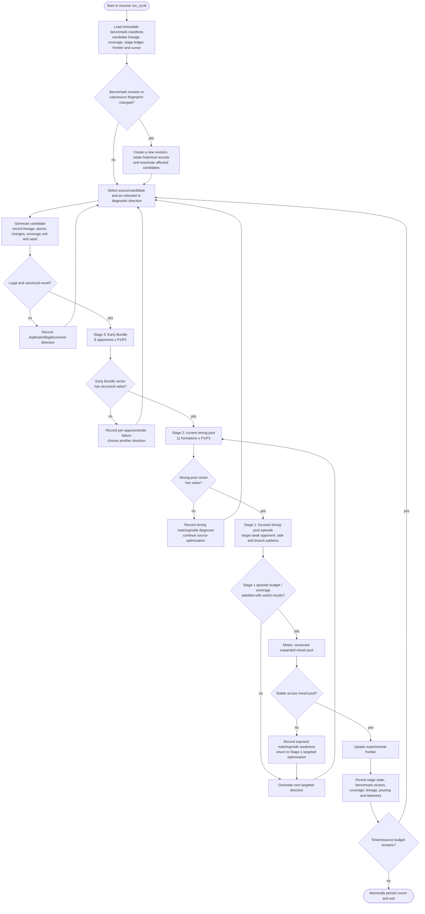

STATUS: OPEN
DOMAIN: tree

# T040 - Staged Benchmark Training Ladder and Melee Transition

> Domain: `tree` | Executor branch: `agent/tree`
> Build on T039. This task defines the long-running benchmark progression for experimental candidate training. It does not change formal product Tier state, active formations, bundle artifacts, deployment, or publishing.

## Terminology Boundary

The terms below are **training stages**, not formal in-game Tier 1 / Tier 2 promotion:

```text
Training Stage 3: candidate / early exploration
Training Stage 2: current-strong-formation validation
Training Stage 1: repeated strong-formation optimization episode
Melee: expanded mixed-pool stability training
```

All outputs remain:

```text
AGGREGATE_EXPLORATION_ONLY
EXPERIMENTAL_UNVERIFIED_NOT_FOR_AUTO_INTEGRATION
NO_APPLY_NO_DEPLOY_NO_PUBLISH_NO_TIER_CHANGE
```

Do not evaluate candidate-vs-parent/self-play as a benchmark. Candidates may acquire different roles after mutation, so self-play is not an explanatory strength test and must not gate stage transitions.

Do not use rule-random benchmark or separate three-opponent `adScore` / separation benchmark. The complete Early Bundle per-opponent result vector replaces it.

## A. Freeze the Three Benchmark Pools

### 1. Training Stage 3: Early Bundle

Create an immutable, fingerprinted historical fixture with exactly eight opponents:

```text
existing seven Early Bundle opponents
+ one explicitly selected historical, relatively weaker Gift Jungle snapshot
```

The selected historical Gift Jungle must have an explicit source file, source fingerprint, historical version/provenance, and must remain distinct from current repaired eight-monster `gift_jungle`. Never silently substitute the current source.

Purpose:

```text
validate candidate structure against stable historical patterns
measure whether a candidate can form meaningful counters to recognizable fixed archetypes
```

### 2. Training Stage 2 and Stage 1: Current Strong Formation Pool

Freeze a fingerprinted current strong-formation benchmark from the 11 current frozen sources. This pool is the high-strength environment.

Purpose:

```text
Stage 2: determine whether an Early-Bundle-qualified candidate works against current strong formations
Stage 1: give qualified candidates several focused optimization cycles against their Stage-1 weak matchup/side patterns before melee exposure
```

The pool itself must remain snapshot/fingerprint pinned per benchmark revision. A changed source fixture establishes a new benchmark revision, invalidates incomparable aggregate ranks, and reactivates affected candidates.

### 3. Melee Pool

Melee is not an entry test for raw candidates. It is an expanded pool reached only after a Stage-1 optimization episode.

Define a versioned, deterministic mixed-pool manifest. Its members may include current strong snapshots, Early Bundle snapshots, and prior experimental candidates only when each member has explicit identity, source pool, fingerprint, and selection reason. It must not draw arbitrary unrecorded live state.

Purpose:

```text
expose overfitting to fixed Early Bundle or current-strong pools
measure stability across broader matchup distributions
identify new matchup / side weaknesses to feed back into Stage 1
```

## B. Long-Running Stage State Machine

Persist source and candidate state in an append-only, resumable training ledger. A candidate has one current training stage:

```text
STAGE_3_EARLY_BUNDLE
STAGE_2_STRONG_POOL
STAGE_1_STRONG_EPISODE
MELEE
EXPERIMENTAL_FRONTIER
```

A failure does not discard the source. Record the failed operator direction and return to its appropriate parent/search coverage state.



## C. Benchmark Evaluation Rules

1. Every benchmark evaluation retains actual P1 and P2 coverage. Do not collapse sides into a single hidden scalar.
2. Use T039's fine-grained task dispatch and staged sampling. Each stage manifest defines its opponent count; all opponent x side cells must be covered at every sampling tier.
3. Preserve complete per-cell aggregate W/D/L vectors. Do not replace them with old three-target `adScore` / separation score.
4. A stage transition compares candidates by their complete vector in the same frozen benchmark revision, including:

```text
aggregate W/D/L
per-opponent and per-side results
weakest matchup / weakest side
known target weakness improvement
```

5. Stage gates must be explicit, deterministic, and versioned. Do not use a hidden global score that allows a strong easy matchup to conceal severe regression against a known critical matchup.
6. A candidate may be retained as a specialized experimental branch if it improves a documented strong-pool counter matchup while losing broader generality. It must be labelled `SPECIALIST_EXPERIMENTAL`, not replace the main generalist frontier automatically.
7. Only candidates that complete their Stage-1 episode may enter melee. Candidates that fail melee return to Stage-1 diagnosis, not all the way to Stage 3.

## D. Search Coverage and Completion Semantics

Record each legal atomic search direction and stage outcome:

```text
sourceId / parent fingerprint / candidate fingerprint
operator family / atomic change or transform / coverage unit
benchmark revision / training stage / sample stage
per-cell vector reference / result classification
reason for transition, retry, de-prioritization or reactivation
```

Search priorities:

```text
1. untested legal direction for the candidate's current stage
2. directions targeting documented weakest opponent/side pattern
3. incomplete Stage-1 episode coverage
4. deterministic multi-monster exploration after configured unsuccessful single-direction episode
5. paused sources only when a new benchmark/rule/coverage opportunity appears
```

A source can be marked `PAUSED_CURRENT_SEARCH_SPACE` only when it has no legal untested current-stage directions and no diagnostic obligation. It is never permanently retired. New benchmark revisions, source changes, new pool members, or new revealed weaknesses reactivate it.

## E. Required Artifacts and Checks

Extend the existing `product_training` single-entry system. `run_cycle.ts` remains the sole unattended command.

Required persisted artifacts:

```text
benchmark_manifests.json                 # Early Bundle 8, current strong pool 11, melee revision(s)
stage_training_ledger.jsonl              # append-only state transitions
benchmark_cell_results.jsonl             # full aggregate opponent x side vectors
candidate_lineage.jsonl                  # parent/child and atomic change identity
search_coverage.jsonl                    # direction-level coverage status
```

Extend checks/tests to prove:

```text
Early Bundle contains exactly seven frozen early sources plus selected historical Gift Jungle
current repaired gift_jungle is never substituted for historical Gift Jungle benchmark fixture
strong pool contains exactly the frozen current 11 with a manifest fingerprint
no candidate-vs-parent/self-play benchmark is dispatched
no rule-random or old three-target separation/adScore benchmark is dispatched
Stage 3 -> Stage 2 -> Stage 1 -> Melee ordering and return paths are enforced
all stage evaluation records contain complete pool x P1/P2 coverage
failed melee candidates return to Stage 1, not Stage 3
stage transitions are deterministic, resumable, and idempotent
specialist candidates cannot overwrite the generalist experimental frontier automatically
all output preserves aggregate-only/no-apply boundary labels
```

## Acceptance

- [ ] Long-running execution can resume from durable stage/candidate/coverage state without duplicate work.
- [ ] Candidates begin only against Early Bundle 8 and progress stepwise.
- [ ] Strong pool is entered only after Early Bundle success; melee only after a Stage-1 strong-pool episode.
- [ ] Complete per-opponent/P1/P2 vectors, not self-play or compressed separation score, drive comparisons.
- [ ] Melee failures become explicit Stage-1 diagnostics.
- [ ] Benchmark revisions are frozen/fingerprinted and historical Gift Jungle is provenance-safe.
- [ ] No formal tier/apply/deploy/publish action exists.

## Delivery

Write `TASKS/tree/T040.report.md` containing command/check results; all manifest identities/fingerprints; historical Gift Jungle provenance; stage transition counts; example candidate lineage; coverage ledger statistics; Early Bundle/strong/melee vector summaries; return-path proof; scheduler telemetry; and explicit aggregate-only/no-apply confirmation. Commit/push only `agent/tree`.
